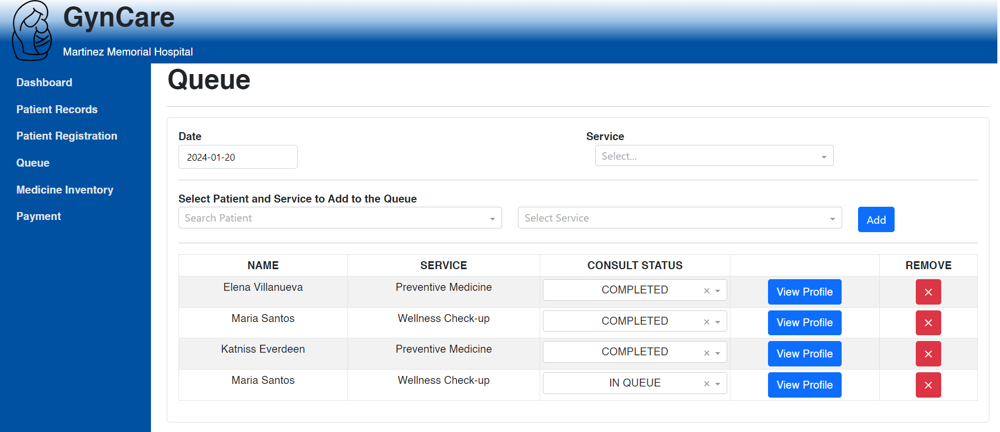
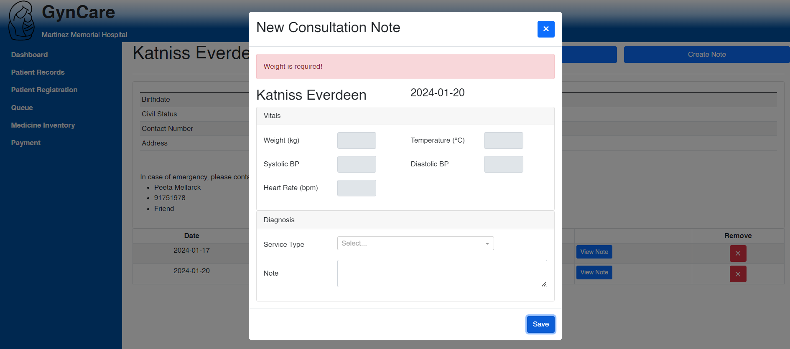
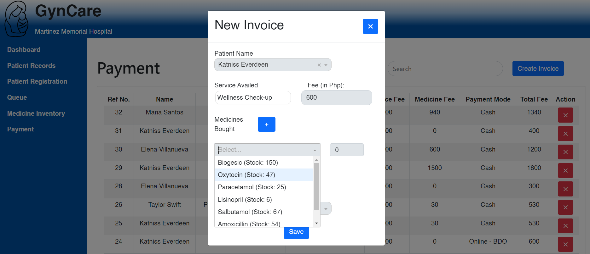

# *GynCare*: A Patient Management System for the OBGYN Department at Martinez Memorial Hospital, Caloocan City

```diff
@@ IE 172 - UPD - Paul De Villa, Kaye Domingo, Nazka Leosala, Joshua Reyes @@
```

## Purpose:

GynCare is an information system designed to improve the efficiency of the operations at Martinez Memorial Hospital. It is a platform that allows stakeholders to manage patient information, medical records, and administrative tasks. Through digitization, the processes involved in accomplishing those duties are modernized, leading to more streamlined support activities.

## Libraries
Install the following:
1. dash: ```pip install dash```
2. dash_bootstrap_components: ```pip install dash_bootstrap_components```
3. dash_mantine_components: ```pip install dash-mantine-components==0.13.0a3```
4. matplotlib: ```pip install matplotlib```

## Database
Use the ```[db] create table.sql``` (required) and ```[db] sample table.sql``` to readily generate sample data. Alternatively, you may create your own data directly from the application.

## Login Page
As a prototype use the following for the applications' login page:
 - Username: ```username```
 - Password: ```admin```

## Sample Images






